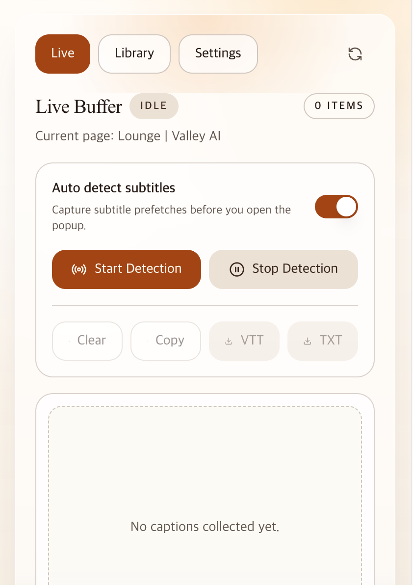

# VTT Collector

Chrome MV3 extension that captures segmented WebVTT subtitles from the active tab, merges them into a single live buffer, and lets you copy or download the collected captions from the popup.

  

## What It Does

- Captures segmented `VTT` subtitle responses from the active tab
- Merges cues into a single buffer
- Removes duplicate cues
- Saves merged captions by page URL
- Reuses previously saved captions when the same page URL is opened again
- Shows collected captions in the popup
- Supports `Copy`, `Download TXT`, `Download VTT`, and `Clear`
- Supports saved-caption download and delete from the popup library
- Enables subtitle auto-detection by default so early subtitle prefetches are less likely to be missed
- Enables URL-based auto save/load by default

## Scope

Current v1 behavior is intentionally narrow.

- Supports `.vtt` subtitle traffic
- Supports `data:` bodies when the decoded content is `WEBVTT`
- Ignores media segments such as `.m4s` and fragmented MP4 payloads
- Merges all valid VTT cues for the current tab into one buffer
- Stores captions by page URL in local extension storage
- Uses popup UI only with `Live`, `Library`, and `Settings` tabs

## Tech Stack

- React
- TypeScript
- Vite
- Manifest V3
- pnpm
- Tailwind CSS
- Radix UI primitives with shadcn-style local components

## Project Structure

- [/Users/dodo/workspace/chrome-extension-vtt-collector/src/page-script.ts](/Users/dodo/workspace/chrome-extension-vtt-collector/src/page-script.ts)
  Page-context `fetch` / `XMLHttpRequest` interception
- [/Users/dodo/workspace/chrome-extension-vtt-collector/src/content.ts](/Users/dodo/workspace/chrome-extension-vtt-collector/src/content.ts)
  Bridge from page context to extension runtime
- [/Users/dodo/workspace/chrome-extension-vtt-collector/src/background.ts](/Users/dodo/workspace/chrome-extension-vtt-collector/src/background.ts)
  Session management, debugger-assisted network capture, downloads
- [/Users/dodo/workspace/chrome-extension-vtt-collector/src/popup/PopupApp.tsx](/Users/dodo/workspace/chrome-extension-vtt-collector/src/popup/PopupApp.tsx)
  Popup UI

## Installation

1. Install dependencies:

```bash
pnpm install
```

2. Build the extension:

```bash
pnpm build
```

3. Open `chrome://extensions`
4. Enable `Developer mode`
5. Click `Load unpacked`
6. Select [/Users/dodo/workspace/chrome-extension-vtt-collector/dist](/Users/dodo/workspace/chrome-extension-vtt-collector/dist)

## Development

Run tests:

```bash
pnpm test
```

Build production output:

```bash
pnpm build
```

## Usage

1. Open a page that loads segmented VTT subtitles
2. Click the extension icon
3. Keep `Auto detect subtitles` enabled
4. If needed, click `Start Detection`
5. Watch captions accumulate in `Live Buffer`
6. Use `Copy`, `TXT`, `VTT`, or `Clear`
7. Open `Library` to re-download or delete captions saved for previous URLs
8. Open `Settings` to control URL-based auto save/load

## Notes

- This extension is optimized for VTT-based subtitle streams, not generic media extraction
- Subtitle traffic may arrive very early during page load, so auto-detect defaults to enabled
- Saved captions are keyed by page URL, not by individual subtitle segment URL
- Some sites require both page-level interception and `chrome.debugger`-assisted capture for stable results

## Troubleshooting

### Captions do not appear in the popup

- Refresh the extension in `chrome://extensions`
- Refresh the target page
- Ensure the site actually loads VTT subtitle traffic
- Keep `Auto detect subtitles` enabled before page load

### Download does not start

- Make sure captions have already been collected
- Reopen the popup and try again

### Saved captions are missing for the same page

- Check `Settings` and confirm `Auto save captions by URL` is enabled
- Saved captions are matched by page URL, so a different URL means a different record

### Korean subtitles look duplicated or corrupted

- Older collected cues may include stale mojibake data from a previous build
- Clear captions once and collect again with the current build

## Additional Documentation

Detailed implementation notes, troubleshooting history, and context-engineering feedback are documented in [docs/implementation-notes.md](/Users/dodo/workspace/chrome-extension-vtt-collector/docs/implementation-notes.md).
